# 🚀 Next.js to Blazor Migration Guide

Comprehensive guide for migrating from the current Next.js implementation to the new Blazor architecture.

## 📋 Table of Contents
- [Migration Overview](#migration-overview)
- [Architecture Comparison](#architecture-comparison)
- [Pre-Migration Steps](#pre-migration-steps)
- [Data Migration](#data-migration)
- [Feature Mapping](#feature-mapping)
- [Deployment Strategy](#deployment-strategy)
- [Testing & Validation](#testing--validation)
- [Go-Live Process](#go-live-process)
- [Post-Migration Tasks](#post-migration-tasks)
- [Rollback Plan](#rollback-plan)

## 🎯 Migration Overview

### Migration Goals
- **Modernization**: Upgrade to .NET 8 and Blazor Server/WebAssembly
- **Performance**: Improved server-side rendering and client-side performance
- **Maintainability**: Better type safety with C# throughout the stack
- **Scalability**: Enhanced deployment options and infrastructure flexibility
- **Feature Parity**: Maintain all existing functionality during transition

### Timeline Overview


## 🏗️ Architecture Comparison

### Current Next.js Architecture

```mermaid
graph TB
    subgraph "Next.js Application"
        NextApp[📱 Next.js App]
        APIRoutes[🔌 API Routes]
        Prisma[🗄️ Prisma ORM]
        NextAuth[🔐 NextAuth.js]
    end
    
    subgraph "External Services"
        Stripe[💳 Stripe]
        PayPal[💰 PayPal]
        Resend[📧 Resend]
        Redis[⚡ Redis]
    end
    
    NextApp --> APIRoutes
    APIRoutes --> Prisma
    NextApp --> NextAuth
    APIRoutes --> Stripe
    APIRoutes --> PayPal
    APIRoutes --> Resend
    APIRoutes --> Redis
```


### Target Blazor Architecture

```mermaid
graph TB
    subgraph "Blazor Application"
        BlazorServer[🌐 Blazor Server]
        BlazorWASM[📱 Blazor WebAssembly]
        API[🔌 Web API Controllers]
        EFCore[🗄️ Entity Framework Core]
        Identity[🔐 ASP.NET Identity]
        SignalR[📡 SignalR Hubs]
    end
    
    subgraph "Clean Architecture Layers"
        Domain[🏗️ Domain Layer]
        Application[⚙️ Application Layer]
        Infrastructure[🔧 Infrastructure Layer]
        Presentation[🎨 Presentation Layer]
    end
    
    BlazorServer --> API
    BlazorWASM --> API
    API --> Application
    Application --> Domain
    Application --> Infrastructure
    Infrastructure --> EFCore
    Presentation --> BlazorServer
```


### Key Differences
| Aspect | Next.js | Blazor |
|--------|---------|---------|
| **Language** | TypeScript/JavaScript | C# |
| **Rendering** | SSR + CSR | Server + WebAssembly |
| **Database** | Prisma ORM | Entity Framework Core |
| **Authentication** | NextAuth.js | ASP.NET Identity |
| **Real-time** | WebSocket | SignalR |
| **Testing** | Jest + Playwright | xUnit + Playwright |
| **Deployment** | Node.js | .NET Runtime |

## 🚀 Pre-Migration Steps

### 1. Environment Setup
```bash
# Install .NET 8 SDK
winget install Microsoft.DotNet.SDK.8

# Verify installation
dotnet --version

# Install Entity Framework tools
dotnet tool install --global dotnet-ef

# Install Blazor templates
dotnet new install Microsoft.AspNetCore.Blazor.ProjectTemplates
```

### 2. Database Analysis
```sql
-- Export current schema for analysis
pg_dump --schema-only -h localhost -U username dorfkiste > current_schema.sql

-- Analyze table relationships
SELECT 
    tc.table_name,
    kcu.column_name,
    ccu.table_name AS foreign_table_name,
    ccu.column_name AS foreign_column_name 
FROM information_schema.table_constraints AS tc 
JOIN information_schema.key_column_usage AS kcu
    ON tc.constraint_name = kcu.constraint_name
JOIN information_schema.constraint_column_usage AS ccu
    ON ccu.constraint_name = tc.constraint_name
WHERE constraint_type = 'FOREIGN KEY';
```

### 3. API Inventory
```typescript
// Document all existing API endpoints
const apiEndpoints = [
  { method: 'GET', path: '/api/items', blazorController: 'ItemsController.GetItems' },
  { method: 'POST', path: '/api/items', blazorController: 'ItemsController.CreateItem' },
  { method: 'GET', path: '/api/rentals', blazorController: 'RentalsController.GetRentals' },
  { method: 'POST', path: '/api/rentals', blazorController: 'RentalsController.CreateRental' },
  // ... map all endpoints
]
```

## 🗄️ Data Migration

### 1. Database Schema Migration
```csharp
// Create Entity Framework migrations from existing schema
public class InitialMigration : Migration
{
    protected override void Up(MigrationBuilder migrationBuilder)
    {
        // User table
        migrationBuilder.CreateTable(
            name: "Users",
            columns: table => new
            {
                Id = table.Column<string>(type: "text", nullable: false),
                Email = table.Column<string>(type: "character varying(255)", maxLength: 255, nullable: false),
                Name = table.Column<string>(type: "character varying(255)", maxLength: 255, nullable: true),
                PasswordHash = table.Column<string>(type: "text", nullable: false),
                Avatar = table.Column<string>(type: "text", nullable: true),
                Bio = table.Column<string>(type: "text", nullable: true),
                CreatedAt = table.Column<DateTime>(type: "timestamp with time zone", nullable: false),
                UpdatedAt = table.Column<DateTime>(type: "timestamp with time zone", nullable: false)
            },
            constraints: table =>
            {
                table.PrimaryKey("PK_Users", x => x.Id);
            });

        // Add indexes
        migrationBuilder.CreateIndex(
            name: "IX_Users_Email",
            table: "Users",
            column: "Email",
            unique: true);
    }
}
```

### 2. Data Transfer Script
```csharp
public class DataMigrationService
{
    private readonly IConfiguration _config;
    private readonly ILogger<DataMigrationService> _logger;

    public async Task MigrateDataAsync()
    {
        var sourceConnection = _config.GetConnectionString("NextJsDatabase");
        var targetConnection = _config.GetConnectionString("BlazorDatabase");

        // Migrate users
        await MigrateUsersAsync(sourceConnection, targetConnection);
        
        // Migrate categories
        await MigrateCategoriesAsync(sourceConnection, targetConnection);
        
        // Migrate items
        await MigrateItemsAsync(sourceConnection, targetConnection);
        
        // Migrate rentals
        await MigrateRentalsAsync(sourceConnection, targetConnection);
        
        // Migrate reviews
        await MigrateReviewsAsync(sourceConnection, targetConnection);
        
        // Verify data integrity
        await VerifyDataIntegrityAsync(targetConnection);
    }

    private async Task MigrateUsersAsync(string source, string target)
    {
        using var sourceConn = new NpgsqlConnection(source);
        using var targetConn = new NpgsqlConnection(target);
        
        var users = await sourceConn.QueryAsync<User>(
            "SELECT Id, email, name, password, avatar, bio, \"createdAt\", \"updatedAt\" FROM \"User\""
        );

        foreach (var user in users)
        {
            await targetConn.ExecuteAsync(@"
                INSERT INTO Users (Id, Email, Name, PasswordHash, Avatar, Bio, CreatedAt, UpdatedAt)
                VALUES (@Id, @Email, @Name, @Password, @Avatar, @Bio, @CreatedAt, @UpdatedAt)
                ON CONFLICT (Id) DO NOTHING",
                user);
        }

        _logger.LogInformation($"Migrated {users.Count()} users");
    }
}
```

### 3. Image Migration
```csharp
public class ImageMigrationService
{
    public async Task MigrateImagesAsync()
    {
        var sourceDir = "/app/public/uploads";
        var targetDir = "/app/wwwroot/uploads";

        // Create target directory structure
        Directory.CreateDirectory(targetDir);

        // Copy all images
        var sourceFiles = Directory.GetFiles(sourceDir, "*", SearchOption.AllDirectories);
        
        foreach (var sourceFile in sourceFiles)
        {
            var relativePath = Path.GetRelativePath(sourceDir, sourceFile);
            var targetFile = Path.Combine(targetDir, relativePath);
            
            Directory.CreateDirectory(Path.GetDirectoryName(targetFile));
            File.Copy(sourceFile, targetFile, overwrite: true);
        }

        // Update database references
        await UpdateImagePathsAsync();
    }

    private async Task UpdateImagePathsAsync()
    {
        // Update image URLs in database to match new structure
        // /uploads/image.jpg stays the same (served from wwwroot)
    }
}
```

## 🔄 Feature Mapping

### 1. Authentication Migration
```csharp
// NextAuth.js → ASP.NET Identity
public class AuthenticationMigrationService
{
    public async Task MigrateAuthenticationAsync()
    {
        // Migrate user accounts
        var nextJsUsers = await GetNextJsUsersAsync();
        
        foreach (var user in nextJsUsers)
        {
            var aspNetUser = new ApplicationUser
            {
                Id = user.Id,
                UserName = user.Email,
                Email = user.Email,
                EmailConfirmed = true,
                Name = user.Name,
                Avatar = user.Avatar,
                Bio = user.Bio
            };

            // Create user with existing password hash
            await _userManager.CreateAsync(aspNetUser, user.PasswordHash);
            
            // Migrate any additional claims or roles
            if (user.IsAdmin)
            {
                await _userManager.AddToRoleAsync(aspNetUser, "Admin");
            }
        }
    }
}

// Configure ASP.NET Identity
public void ConfigureServices(IServiceCollection services)
{
    services.AddIdentity<ApplicationUser, IdentityRole>(options =>
    {
        options.Password.RequireDigit = true;
        options.Password.RequiredLength = 8;
        options.Password.RequireNonAlphanumeric = false;
        options.User.RequireUniqueEmail = true;
    })
    .AddEntityFrameworkStores<ApplicationDbContext>()
    .AddDefaultTokenProviders();
}
```

### 2. API Controllers Migration
```csharp
// Next.js API Route → ASP.NET Controller
[ApiController]
[Route("api/[controller]")]
public class ItemsController : ControllerBase
{
    private readonly IItemService _itemService;
    private readonly IMapper _mapper;

    public ItemsController(IItemService itemService, IMapper mapper)
    {
        _itemService = itemService;
        _mapper = mapper;
    }

    [HttpGet]
    public async Task<ActionResult<PagedResult<ItemDto>>> GetItems(
        [FromQuery] ItemFilterRequest request)
    {
        var items = await _itemService.GetItemsAsync(request);
        return Ok(items);
    }

    [HttpPost]
    [Authorize]
    public async Task<ActionResult<ItemDto>> CreateItem(CreateItemRequest request)
    {
        var userId = User.GetUserId();
        var item = await _itemService.CreateItemAsync(request, userId);
        return CreatedAtAction(nameof(GetItem), new { id = item.Id }, item);
    }
}
```

### 3. Component Migration
```razor
@* Next.js Component → Blazor Component *@
@page "/items"
@inject IItemService ItemService
@inject IJSRuntime JSRuntime

<PageTitle>Alle Artikel - Dorfkiste</PageTitle>

<div class="max-w-7xl mx-auto px-4 py-8">
    <div class="flex justify-between items-center mb-8">
        <h1 class="text-3xl font-bold text-gray-900">Alle Artikel</h1>
        <AuthorizeView>
            <Authorized>
                <a href="/items/new" class="btn btn-primary">
                    Artikel einstellen
                </a>
            </Authorized>
        </AuthorizeView>
    </div>

    <div class="grid gap-6 md:grid-cols-2 lg:grid-cols-3 xl:grid-cols-4">
        @foreach (var item in items)
        {
            <ItemCard Item="item" OnItemClick="HandleItemClick" />
        }
    </div>

    @if (isLoading)
    {
        <LoadingSpinner />
    }
</div>

@code {
    private List<ItemDto> items = new();
    private bool isLoading = true;

    protected override async Task OnInitializedAsync()
    {
        await LoadItemsAsync();
    }

    private async Task LoadItemsAsync()
    {
        isLoading = true;
        try
        {
            var result = await ItemService.GetItemsAsync(new ItemFilterRequest());
            items = result.Items.ToList();
        }
        finally
        {
            isLoading = false;
        }
    }

    private async Task HandleItemClick(ItemDto item)
    {
        await JSRuntime.InvokeVoidAsync("window.location.href", $"/items/{item.Id}");
    }
}
```

### 4. Payment Integration Migration
```csharp
// Stripe integration remains similar, but with C# SDK
public class PaymentService : IPaymentService
{
    private readonly StripeClient _stripeClient;
    private readonly ILogger<PaymentService> _logger;

    public PaymentService(IConfiguration config, ILogger<PaymentService> logger)
    {
        StripeConfiguration.ApiKey = config["Stripe:SecretKey"];
        _stripeClient = new StripeClient(StripeConfiguration.ApiKey);
        _logger = logger;
    }

    public async Task<PaymentIntentDto> CreatePaymentIntentAsync(CreatePaymentIntentRequest request)
    {
        var options = new PaymentIntentCreateOptions
        {
            Amount = request.Amount,
            Currency = "eur",
            Metadata = new Dictionary<string, string>
            {
                { "rental_id", request.RentalId }
            }
        };

        var service = new PaymentIntentService(_stripeClient);
        var paymentIntent = await service.CreateAsync(options);

        return new PaymentIntentDto
        {
            ClientSecret = paymentIntent.ClientSecret,
            PaymentIntentId = paymentIntent.Id
        };
    }
}
```

## 🚀 Deployment Strategy

### 1. Blue-Green Deployment

```mermaid
graph TB
    subgraph "Current Production (Blue)"
        BlueLB[⚖️ Load Balancer]
        BlueApp1[🌐 Next.js App 1]
        BlueApp2[🌐 Next.js App 2]
        BlueDB[(🗄️ Current Database)]
    end
    
    subgraph "New Production (Green)"
        GreenLB[⚖️ Load Balancer]
        GreenApp1[🌐 Blazor App 1]
        GreenApp2[🌐 Blazor App 2]
        GreenDB[(🗄️ Migrated Database)]
    end
    
    subgraph "Shared Services"
        Redis[(⚡ Redis)]
        Files[📁 File Storage]
        External[🔌 External APIs]
    end
    
    BlueApp1 --> BlueDB
    BlueApp2 --> BlueDB
    GreenApp1 --> GreenDB
    GreenApp2 --> GreenDB
    
    BlueApp1 --> Redis
    BlueApp2 --> Redis
    GreenApp1 --> Redis
    GreenApp2 --> Redis
```


### 2. Deployment Steps
```bash
#!/bin/bash
# Blazor deployment script

set -e

echo "🚀 Starting Blazor deployment..."

# 1. Build the application
echo "📦 Building Blazor application..."
dotnet build --configuration Release
dotnet publish --configuration Release --output ./publish

# 2. Database migration
echo "🗄️ Running database migrations..."
dotnet ef database update --configuration Release

# 3. Data migration (one-time)
if [ "$MIGRATE_DATA" = "true" ]; then
    echo "📊 Migrating data from Next.js..."
    dotnet run --project DataMigration --configuration Release
fi

# 4. Deploy to staging
echo "🎭 Deploying to staging..."
docker build -t dorfkiste-blazor:staging .
docker tag dorfkiste-blazor:staging registry.example.com/dorfkiste-blazor:staging
docker push registry.example.com/dorfkiste-blazor:staging

# 5. Run integration tests
echo "🧪 Running integration tests..."
dotnet test --configuration Release --logger trx --results-directory TestResults

# 6. Deploy to production (if tests pass)
if [ $? -eq 0 ]; then
    echo "✅ Tests passed, deploying to production..."
    kubectl set image deployment/dorfkiste-blazor blazor=registry.example.com/dorfkiste-blazor:staging
    kubectl rollout status deployment/dorfkiste-blazor
else
    echo "❌ Tests failed, aborting deployment"
    exit 1
fi

echo "🎉 Deployment completed successfully!"
```

### 3. Docker Configuration
```dockerfile
# Optimized Blazor Dockerfile
FROM mcr.microsoft.com/dotnet/aspnet:8.0 AS base
WORKDIR /app
EXPOSE 80
EXPOSE 443

FROM mcr.microsoft.com/dotnet/sdk:8.0 AS build
WORKDIR /src
COPY ["src/DorfkisteBlazor.Server/DorfkisteBlazor.Server.csproj", "src/DorfkisteBlazor.Server/"]
COPY ["src/DorfkisteBlazor.Application/DorfkisteBlazor.Application.csproj", "src/DorfkisteBlazor.Application/"]
COPY ["src/DorfkisteBlazor.Domain/DorfkisteBlazor.Domain.csproj", "src/DorfkisteBlazor.Domain/"]
COPY ["src/DorfkisteBlazor.Infrastructure/DorfkisteBlazor.Infrastructure.csproj", "src/DorfkisteBlazor.Infrastructure/"]

RUN dotnet restore "src/DorfkisteBlazor.Server/DorfkisteBlazor.Server.csproj"
COPY . .
WORKDIR "/src/src/DorfkisteBlazor.Server"
RUN dotnet build "DorfkisteBlazor.Server.csproj" -c Release -o /app/build

FROM build AS publish
RUN dotnet publish "DorfkisteBlazor.Server.csproj" -c Release -o /app/publish

FROM base AS final
WORKDIR /app
COPY --from=publish /app/publish .

# Health check
HEALTHCHECK --interval=30s --timeout=10s --start-period=60s --retries=3 \
  CMD curl -f http://localhost/health || exit 1

ENTRYPOINT ["dotnet", "DorfkisteBlazor.Server.dll"]
```

## 🧪 Testing & Validation

### 1. Migration Testing Strategy
```csharp
[TestClass]
public class MigrationValidationTests
{
    [TestMethod]
    public async Task ValidateDataMigration_AllUsersTransferred()
    {
        // Arrange
        var sourceCount = await GetNextJsUserCountAsync();
        
        // Act
        await RunDataMigrationAsync();
        
        // Assert
        var targetCount = await GetBlazorUserCountAsync();
        Assert.AreEqual(sourceCount, targetCount, "User count mismatch after migration");
    }

    [TestMethod]
    public async Task ValidateAPICompatibility_AllEndpointsWork()
    {
        var endpoints = GetAllApiEndpoints();
        
        foreach (var endpoint in endpoints)
        {
            var response = await _httpClient.GetAsync(endpoint.Path);
            Assert.IsTrue(response.IsSuccessStatusCode, 
                $"Endpoint {endpoint.Path} failed with status {response.StatusCode}");
        }
    }

    [TestMethod]
    public async Task ValidatePerformance_LoadTimeAcceptable()
    {
        var stopwatch = Stopwatch.StartNew();
        var response = await _httpClient.GetAsync("/items");
        stopwatch.Stop();

        Assert.IsTrue(stopwatch.ElapsedMilliseconds < 2000, 
            $"Page load time {stopwatch.ElapsedMilliseconds}ms exceeds threshold");
    }
}
```

### 2. E2E Testing with Playwright
```csharp
[TestClass]
public class BlazorE2ETests : PlaywrightTestBase
{
    [TestMethod]
    public async Task UserCanRentItem_EndToEnd()
    {
        // Navigate to items page
        await Page.GotoAsync("/items");
        
        // Find and click on an item
        await Page.ClickAsync("[data-testid='item-card']:first-child");
        
        // Verify item details page loaded
        await Expect(Page.Locator("h1")).ToContainTextAsync("Bohrmaschine");
        
        // Click rent button
        await Page.ClickAsync("[data-testid='rent-button']");
        
        // Fill rental form
        await Page.FillAsync("[data-testid='start-date']", "2024-06-01");
        await Page.FillAsync("[data-testid='end-date']", "2024-06-03");
        
        // Submit rental request
        await Page.ClickAsync("[data-testid='submit-rental']");
        
        // Verify success message
        await Expect(Page.Locator("[data-testid='success-message']"))
            .ToContainTextAsync("Buchungsanfrage gesendet");
    }
}
```

### 3. Performance Comparison
```csharp
public class PerformanceBenchmark
{
    [Benchmark]
    public async Task NextJs_ItemsPage()
    {
        var response = await _nextJsClient.GetAsync("/api/items");
        var content = await response.Content.ReadAsStringAsync();
    }

    [Benchmark]
    public async Task Blazor_ItemsPage()
    {
        var response = await _blazorClient.GetAsync("/api/items");
        var content = await response.Content.ReadAsStringAsync();
    }
}
```

## 🌐 Go-Live Process

### 1. Pre-Go-Live Checklist
```markdown
## Database Migration
- [ ] Full data backup completed
- [ ] Migration scripts tested on staging
- [ ] Data integrity validation passed
- [ ] Performance benchmarks acceptable

## Application Deployment
- [ ] Blazor application built and tested
- [ ] All integration tests passing
- [ ] Load testing completed
- [ ] Security scan completed

## Infrastructure
- [ ] Production environment provisioned
- [ ] SSL certificates installed
- [ ] Monitoring and alerting configured
- [ ] Log aggregation setup

## Team Readiness
- [ ] On-call team briefed
- [ ] Rollback procedures documented
- [ ] Communication plan activated
- [ ] Support documentation updated
```

### 2. Go-Live Timeline
```bash
# Migration Day Schedule (EST)
# 02:00 - Start maintenance window
# 02:15 - Database backup and migration
# 03:00 - Deploy Blazor application
# 03:30 - Run smoke tests
# 04:00 - Update DNS/Load balancer
# 04:15 - Monitor for issues
# 05:00 - End maintenance window (if successful)
```

### 3. Monitoring During Go-Live
```csharp
public class GoLiveMonitoring
{
    public async Task MonitorSystemHealth()
    {
        var checks = new[]
        {
            CheckDatabaseConnectivity(),
            CheckAPIResponseTimes(),
            CheckUserAuthentication(),
            CheckPaymentProcessing(),
            CheckEmailDelivery()
        };

        await Task.WhenAll(checks);
    }

    private async Task CheckAPIResponseTimes()
    {
        var endpoints = new[] { "/api/items", "/api/rentals", "/api/users" };
        
        foreach (var endpoint in endpoints)
        {
            var stopwatch = Stopwatch.StartNew();
            var response = await _httpClient.GetAsync(endpoint);
            stopwatch.Stop();

            if (stopwatch.ElapsedMilliseconds > 2000)
            {
                await AlertSlackAsync($"⚠️ Slow response time: {endpoint} took {stopwatch.ElapsedMilliseconds}ms");
            }
        }
    }
}
```

## 📈 Post-Migration Tasks

### 1. Performance Optimization
```csharp
// Enable response compression
public void ConfigureServices(IServiceCollection services)
{
    services.AddResponseCompression(options =>
    {
        options.EnableForHttps = true;
        options.Providers.Add<BrotliCompressionProvider>();
        options.Providers.Add<GzipCompressionProvider>();
    });
}

// Configure caching
services.AddMemoryCache();
services.AddStackExchangeRedisCache(options =>
{
    options.Configuration = Configuration.GetConnectionString("Redis");
});

// Add health checks
services.AddHealthChecks()
    .AddDbContext<ApplicationDbContext>()
    .AddRedis(Configuration.GetConnectionString("Redis"));
```

### 2. Monitoring and Alerting
```csharp
// Custom metrics collection
public class ApplicationMetrics
{
    private static readonly Counter RequestCount = Metrics
        .CreateCounter("dorfkiste_requests_total", "Total number of requests");
    
    private static readonly Histogram RequestDuration = Metrics
        .CreateHistogram("dorfkiste_request_duration_seconds", "Request duration");

    public static void RecordRequest(string endpoint, double duration)
    {
        RequestCount.WithLabels(endpoint).Inc();
        RequestDuration.Observe(duration);
    }
}
```

### 3. Documentation Updates
```markdown
## Updated Documentation
- [ ] API documentation updated for new endpoints
- [ ] Architecture diagrams updated
- [ ] Deployment procedures documented
- [ ] Troubleshooting guides created
- [ ] Performance baselines established
```

## 🔄 Rollback Plan

### 1. Rollback Triggers
- Critical bugs affecting user experience
- Performance degradation >50%
- Payment processing failures
- Data integrity issues
- Security vulnerabilities

### 2. Rollback Procedure
```bash
#!/bin/bash
# Emergency rollback script

echo "🚨 EMERGENCY ROLLBACK INITIATED"

# 1. Switch load balancer back to Next.js
kubectl patch service dorfkiste-service -p '{"spec":{"selector":{"app":"dorfkiste-nextjs"}}}'

# 2. Restore database from backup (if needed)
if [ "$RESTORE_DATABASE" = "true" ]; then
    pg_restore -h $DB_HOST -U $DB_USER -d dorfkiste backup_pre_migration.dump
fi

# 3. Verify Next.js application is healthy
for i in {1..10}; do
    if curl -f http://localhost/api/health; then
        echo "✅ Next.js application is responding"
        break
    fi
    sleep 10
done

# 4. Notify team
curl -X POST $SLACK_WEBHOOK_URL -d '{"text":"🔄 Rollback completed - Next.js application restored"}'

echo "✅ Rollback completed successfully"
```

### 3. Post-Rollback Analysis
```markdown
## Rollback Analysis Template
### What Happened?
- Root cause of the issue
- Timeline of events
- Impact assessment

### What Went Wrong?
- Testing gaps identified
- Process improvements needed
- Technical issues discovered

### Action Items
- [ ] Fix identified issues
- [ ] Update testing procedures
- [ ] Improve monitoring
- [ ] Schedule retry deployment
```

## 📊 Success Metrics

### Key Performance Indicators
- **Migration Success**: 100% data integrity maintained
- **Downtime**: <30 minutes during maintenance window
- **Performance**: ≤20% degradation in page load times
- **User Experience**: No increase in support tickets
- **Bug Rate**: <5 critical bugs in first week

### Monitoring Dashboard
```json
{
  "dashboards": [
    {
      "name": "Migration Health",
      "panels": [
        { "metric": "http_requests_total", "threshold": "baseline + 20%" },
        { "metric": "response_time_p95", "threshold": "2s" },
        { "metric": "error_rate", "threshold": "1%" },
        { "metric": "database_connections", "threshold": "80% capacity" }
      ]
    }
  ]
}
```

---

This migration guide provides a comprehensive roadmap for transitioning from Next.js to Blazor while maintaining system stability and user experience. Regular review and updates of this document throughout the migration process will ensure successful completion of the project.